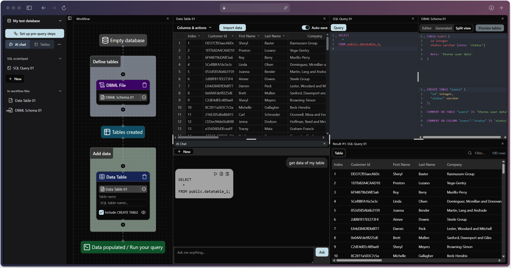

<div align="center">
    
    <h1>pgExplore</h1>
</div>

<h3 align="center">Web-based PostgreSQL data explorer with AI, workflow builder, integration, ... and more are being added! (Under active development)</h3>



I just created a local-first toolbox for my data analysis needs and made it runnable locally on the browser with a [PGlite](https://github.com/electric-sql/pglite) backend! Some cool features:

- Create your Postgres databases in seconds and perform your query directly in your browser (thanks to PGlite)
- Drag and drop your CSV, JSON files into the app and instantly have them as Postgres tables.
- Data grid editor allows you to edit your data in a table-like way.
- With the tables you created, chat with the AI to create a query for your needs, for example, "Find the average salary per department," then execute that query with one click!
- Provide your own AI by setting the custom endpoint.
- Your SQL queries and imported table data are treated as app files, and you can create an execution workflow with those files.
- Some DDL languages such as [DBML](https://dbml.dbdiagram.io/home) are also supported.
- Postgres extensions are supported.

This web app is still unfinished (usable but expect bugs) and under active development. In the future, I will make it able to:
- Visualize current database tables.
- Create embed URLs like Codepen, Codesandbox to be able to preview SQL snippets.
- Export database dumps and files.
- Visualize query result as charts?

Ask for a feature, and you will have me implement it if I find it useful.

---

Try it out at [pg-explore.vercel.app](https://pg-explore.vercel.app). It will cache the data in your browser (PWA), and then you can use it offline the next time you visit the site. Or host it locally in the section below!

You can keep me motivated just by using this site or starring this repo. Motivation powers open-source development, as always! Feature requests & bug reports are also highly appreciated! 

---

## Development

(Optional) You can set up the env for the default AI integration (OpenAI compatible API). Or just configure it later in the app settings (per browser config).
```
VITE_AI_API_KEY=<YOUR_API_KEY>
VITE_AI_BASE_URL=https://generativelanguage.googleapis.com/v1beta/openai
VITE_AI_MODEL=gemini-2.0-flash
```

### To start the site

```bash
pnpm i
pnpm dev
```

### Build distribution

```bash
npx tsc -b && pnpm build
```

## TODO backlog :D
Suggest any ideas, report bugs - it helps!

### Currently doing
- [x] Create Postgres databases
  - [x] Non-persistent (for embeddable iframes in the future)
  - [x] Persistent (IndexedDB)
- [x] Reorderable layout (implement with Dockview)
- [x] File browser sidebar
  - [x] File interaction
    - [x] Create/Rename/Delete file
- [x] SQL query (tab #1)
  - [x] Run
    - [x] Run selected
    - [x] Run hotkey
  - [x] Parse
    - [x] Inject pg_dump schema
  - [x] Lint (kinda ass rn)
- [x] Query result as table (tab #2 / subtab #1)
  - [x] Infinite scroll with virtualization
  - [x] Filter
- [x] Workflow builder and step runner (implement with React Flow) (tab #3)
  - [x] Base nodes and groups
  - [x] Begin-to-end evaluation
  - [x] Replay n-1 steps before error
- [x] AI chat (tab #4)
  - [x] Inject pg_dump schema
  - [x] Chat feature
- [x] Settings popup
  - [x] Dark mode
  - [x] Enable SQL linter
  - [x] Use custom AI endpoint
  - [x] Debug mode & reset everything
- [x] More databases popup
  - [x] Rename/Delete database
  - [x] See disk usage
- [x] Postgres extensions
  - [x] Enable/disable extensions per database
- [x] DBML schema (tab #5)
  - [x] Parse + autocompletion (with Lezer grammar)
  - [x] Lint
- [x] Table data editor (tab #6) (with Handsontable (it's so good for Excel-like capability but not free) / open-source alt in the future?)
  - [x] Import CSV
  - [x] Import JSON
  - [x] Data type config
    - [x] Data type
    - [x] Unique/null/Autoincrement
  - [x] Auto detect column type
  - [x] Dark mode

### Will do next
- [ ] AI node in workflow builder
- [ ] Tables & relationship visualization
  - [ ] Table
    - [ ] Name
    - [ ] Datatype
    - [ ] Modifiers
  - [ ] Relationship
  - [ ] Auto-layout

### In consideration
- [ ] Export embeddable iframes
- [ ] View query result as charts
- [ ] Import/Export workflow and files
- [ ] Import/Export database dump
- [ ] REPL console (supporting \d commands, pg_dump,...)
- [ ] Populate random data workflow step (implement with Faker.js?)
- [ ] More AI (actually, I'm not too hyped for this)
  - Copilot/Cursor-like suggestion
  - Inline suggestion
- [ ] Proper unit, E2E, performance tests (pardon my overconfidence in code -_-)
