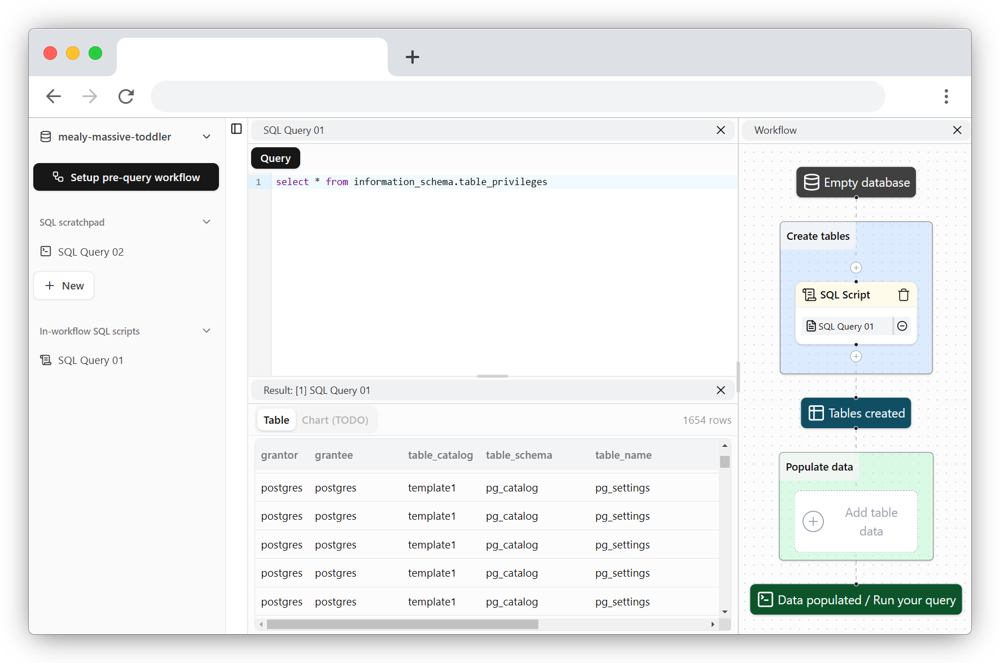

<div align="center">
    
    <h1>pgExplore</h1>
</div>

<h3 align="center">Web-based PostgreSQL data explorer with AI, workflow builder, integration, ... and more are being added!</h3>



"Most database clients are so unintuitive, except those integrated in Jetbrains' apps, which I already use daily." But even with the most advanced clients, they still can't help my unreasonably specific use cases. 

Then I found [PGlite](https://github.com/electric-sql/pglite), which is a lightweight Postgres server that runs in a browser. "Why don't I create my own Postgres toolbox runnable anywhere for my gridsmaxxing at work?", I wondered. And so began this repo—purely to support my use-case driven needs. If your needs align with mine, this project could help:

- I have CSV, JSON data of unknown structure that people sent to me. I want to dump all of them into Postgres and use some LLM to "give me the top 5 most active accounts per group, JSON-aggregated." It should know the schema (but not the data, unless I specify that) and provide a runnable SQL query. I then run it, modify it, and ask the AI to modify it for me for more complex cases.

- I want to create some tables with my [DBML](https://dbml.dbdiagram.io/home) schema I wrote some time ago, then ask AI to create more tables, and store my reusable queries in the browser. And, I have multiple types of data sources and want to combine them.

- (TODO) I want to add "Codepen/JSFiddle snippets but for SQL queries" in my blogs to archive some cool SQL patterns and benchmarks (select top 1 per group, CTE/subquery vs lateral join performance of multiple cardinalities)

---

Try it out at [pg-explore.vercel.app](https://pg-explore.vercel.app). It will cache the data in your browser (PWA), and then you can use it offline the next time you visit the site. Or host it locally in the section below!

You can keep me motivated just by using this site or starring this repo. Motivation powers open-source development, as always!

---

## TODO backlog :D
Suggest any ideas, report bugs - it helps!

### Currently doing
- [x] Create Postgres databases
  - [x] Non-persistent (for embeddable iframes in the future)
  - [x] Persistent (IndexedDB)
- [x] Reorderable layout (implement with Dockview)
- [x] File browser sidebar
  - [x] File interaction
    - [x] Create/Rename/Delete file
- [x] SQL query (tab #1)
  - [x] Run
    - [x] Run selected
    - [x] Run hotkey
  - [x] Parse
    - [x] Inject pg_dump schema
  - [x] Lint (kinda ass rn)
- [x] Query result as table (tab #2 / subtab #1)
  - [x] Infinite scroll with virtualization
  - [x] Filter
- [x] Workflow builder and step runner (implement with React Flow) (tab #3)
  - [x] Base nodes and groups
  - [x] Begin-to-end evaluation
  - [x] Replay n-1 steps before error
- [x] AI chat (tab #4)
  - [x] Inject pg_dump schema
  - [x] Chat feature
- [x] Settings popup
  - [x] Dark mode
  - [x] Enable SQL linter
  - [x] Use custom AI endpoint
  - [x] Debug mode & reset everything
- [x] More databases popup
  - [x] Rename/Delete database
  - [x] See disk usage
- [x] Postgres extensions
  - [x] Enable/disable extensions per database
- [x] DBML schema (tab #5)
  - [x] Parse + autocompletion (with Lezer grammar)
  - [x] Lint
- [ ] Table data editor (tab #6) (with AG grid (it's so good for Excel-like capability) / open-source alt in the future?)
  - [ ] Import CSV
  - [ ] Import JSON
  - [ ] Data type config
    - [ ] Data type
    - [ ] Unique/null/Autoincrement
  - [ ] Auto detect column type

### Will do next
- [ ] Dark mode
- [ ] AI node in workflow builder
- [ ] Tables & relationship visualization
  - [ ] Table
    - [ ] Name
    - [ ] Datatype
    - [ ] Modifiers
  - [ ] Relationship
  - [ ] Auto-layout

### In consideration
- [ ] Export embeddable iframes
- [ ] Import/Export workflow and files
- [ ] Import/Export database dump
- [ ] REPL console (supporting \d commands, pg_dump,...)
- [ ] Populate random data workflow step (implement with Faker.js?)
- [ ] More AI (actually, I'm not too hyped for this)
  - Copilot/Cursor-like suggestion
  - Inline suggestion
- [ ] Proper unit tests (pardon my overconfidence in code)

## Development

(Optional) You can set up the env for default AI integration (OpenAI compatible API). Or just configure later in the app settings (per browser config).
```
VITE_AI_API_KEY=<YOUR_API_KEY>
VITE_AI_BASE_URL=https://generativelanguage.googleapis.com/v1beta/openai
VITE_AI_MODEL=gemini-2.0-flash
```

### To start the site

```bash
pnpm i
pnpm dev
```

### Build distribution

```bash
npx tsc -b
pnpm build
```
