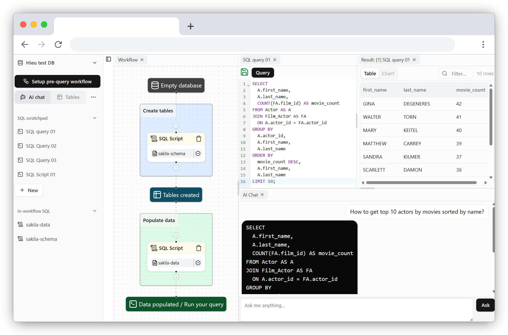

<div align="center">
    
    <h1>pgExplore</h1>
</div>

<h3 align="center">Web PostgreSQL data explorer with AI, extensions, workflow builder, visualizer, integration,... and God knows what I will add in the future??</h3>



"Most database clients are so unintuitive, except those integrated in Jetbrains' apps, which I already use daily." But even with the most advanced clients, it still can't help my unreasonably specific use cases. 

Then I found [PGlite](https://github.com/electric-sql/pglite), which is a lightweight Postgres server that can run in a browser. "Why don't I create my own Postgres toolbox that can run anywhere to ease my gridmaxxing at work?", I wondered. And so began this repo—purely to support my use-case driven needs.

- I have CSV, JSON data of unknown structure. I want to dump all of them into Postgres and use some LLM to "give me the top 5 most active accounts per group, JSON-aggregated." It should know the schema (but not the data, unless specified) and provide a runnable SQL query. I then run it, modify it, and ask the AI to modify it for me for more complex cases.

- The other time, I want to create the tables with my DBML schema I wrote some time ago, and also I want to store my reusable queries in the browser. Why not make it work as a workflow/node-chain and language agnostic while I'm at it?

---

Try it out at [pg-explore.vercel.app](https://pg-explore.vercel.app). It will download to your browser once, and then you can use it offline the next time you visit the site (PWA). Or host it locally in the section below!

The more people use it, or star this repo, the more I am motivated to develop more! Gotta love those steadily increasing numbers :)

## TODO backlog :D
Suggest any ideas, report bugs - it helps!

### Currently doing
- [x] Create Postgres databases
  - [x] Non-persistent (for embeddable iframes in the future)
  - [x] Persistent (IndexedDB)
- [x] Reorderable layout (implement with Dockview)
- [x] File browser sidebar
  - [x] File interaction
    - [x] Create/Rename/Delete file
- [x] SQL query (tab #1)
  - [x] Run
    - [x] Run selected
    - [x] Run hotkey
  - [x] Parse
    - [x] Inject pg_dump schema
  - [x] Lint (kinda ass rn)
- [x] Query result as table (tab #2 / subtab #1)
  - [x] Infinite scroll
  - [x] Filter
- [x] Workflow builder and step runner (implement with React Flow) (tab #3)
  - [x] Base nodes and groups
  - [x] Begin-to-end evaluation
  - [x] Replay n-1 steps before error
- [x] AI chat (tab #4)
  - [x] Inject pg_dump schema
  - [x] Q&A
  - [x] Clear screen
- [x] Settings popup
  - [x] Dark mode
  - [x] Enable SQL linter
  - [x] Use custom AI endpoint
  - [x] Debug mode & reset everything
- [x] More databases popup
  - [x] Rename/Delete database
  - [x] See disk usage
- [x] Postgres extensions
  - [x] Enable/disable extensions per database
- [x] DBML schema (tab #5)
  - [ ] Parse (with Lezer grammar)
  - [x] Lint
- [ ] Table data editor (tab #6) (with AG grid / open-source alt in the future)
  - [ ] Import CSV
  - [ ] Import JSON
  - [ ] Data type selector
    - [ ] Data type
    - [ ] Unique/null
  - [ ] Auto detect column type

### Will do next
- [ ] AI node in workflow builder
- [ ] Tables & relationship visualization
  - [ ] Table
    - [ ] Name
    - [ ] Datatype
    - [ ] Null/unique/primary
  - [ ] Relationship
  - [ ] Auto-layout
- [ ] Dark mode

### In consideration
- [ ] Export embeddable iframes
- [ ] Import/Export workflow and files
- [ ] Import/Export database dump
- [ ] REPL console (supporting \d commands, pg_dump,...)
- [ ] Populate random data step (implement with Faker.js)

## Development

(Optional) You can setup some env for default AI integration (OpenAI compatible API). Or just configure later in the app settings (per browser config).
```
VITE_AI_API_KEY=<YOUR_API_KEY>
VITE_AI_BASE_URL=https://generativelanguage.googleapis.com/v1beta/openai
VITE_AI_MODEL=gemini-2.0-flash
```

### Start the site

```bash
git clone https://github.com/dqhieuu/pg-explore.git
cd pg-explore
pnpm i
pnpm dev
```

### Build distribution

```bash
npx tsc -b
pnpm build
```
